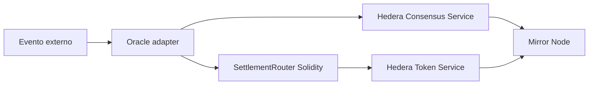

# Scaffold HBAR Verifiable Settlement

> Status: planejamento e fundação do template para o Scaffold-HBAR Template Bounty.

Template reutilizável para liquidação verificável baseada em eventos na Hedera.

## Fluxo



O oracle normaliza e assina/atesta o dado externo. O hash e metadados auditáveis são publicados no HCS; o contrato valida a regra e liquida crédito via HTS; Mirror Node fornece a trilha verificável.

## Princípios
- Foundation, não demo: interfaces extensíveis e exemplos substituíveis.
- HCS, HTS, Solidity, Mirror Node e oracle têm papéis indispensáveis.
- Sem secrets, chaves privadas ou credenciais no Git.
- Compatível com `npm create scaffold-hbar@latest -- --template fmartns/scaffold-hbar-verifiable-settlement`.

## Usar como template

```bash
npm create scaffold-hbar@latest -- --template fmartns/scaffold-hbar-verifiable-settlement
```

O `--` é obrigatório: sem ele o npm consome `--template` e o CLI não o recebe. Requer Node.js >= 20.18.3, Git com `user.name`/`user.email` e Yarn. O contrato de compatibilidade com o CLI está em [docs/scaffold-compat.md](docs/scaffold-compat.md).

## Comandos

Monorepo Yarn Workspaces (`packages/hardhat`, `packages/nextjs`, `packages/sdk`).

| Comando | O que faz |
|---|---|
| `yarn install` | Instala todas as dependências |
| `yarn doctor` | Verifica Node, Yarn e `.env` |
| `yarn dev` (ou `yarn start`) | Sobe o app Next.js em modo desenvolvimento |
| `yarn build` | Compila SDK, contratos e app |
| `yarn lint` | ESLint em todos os packages, sem warnings |
| `yarn check` | `lint` + `check-types` + `test` (o que a CI executa) |
| `yarn test` | Testes do SDK e dos contratos |

Planejados nas issues seguintes: `yarn setup`, `yarn test:integration`, `yarn test:e2e` e `yarn verify:testnet`.

Consulte [docs/architecture.md](docs/architecture.md) e [AGENTS.md](AGENTS.md).

Regras oficiais do bounty, gate de elegibilidade, rubrica e checklist de submissão: [docs/bounty-rules.md](docs/bounty-rules.md).

Benchmark de DX em scaffolds multi-chain e requisitos para #4, #24, #11 e #12: [docs/dx-benchmark.md](docs/dx-benchmark.md).
