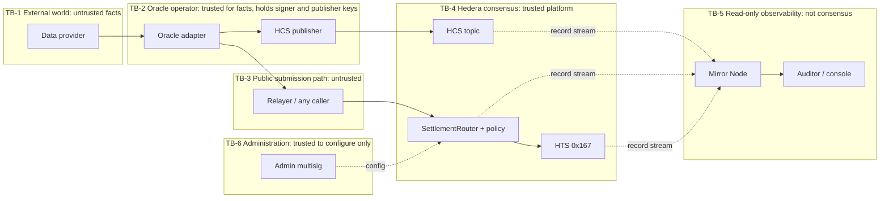
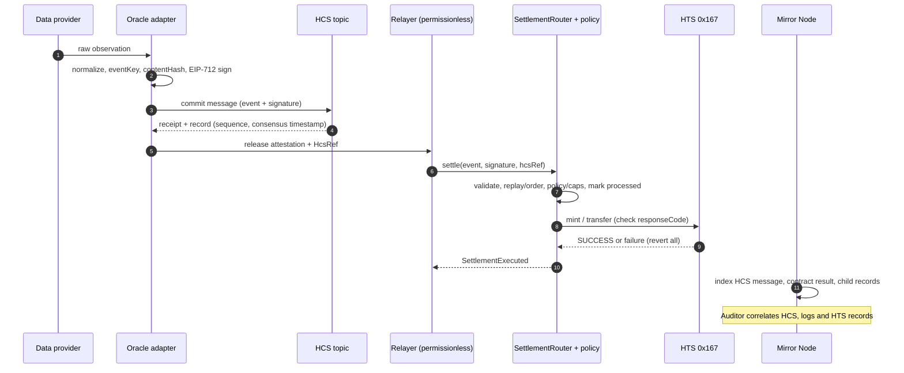

# Architecture Decision Record

## ADR-001 — Verifiable settlement: trust model, identity, idempotency and replay protection

| Field | Value |
|---|---|
| Status | **Proposed.** Issue #3 requires the ADR to be *approved*; this document does not self-approve. |
| Date | 2026-09-18 |
| Issue | #3 |
| Depends on | #21 (use case — **still open**), benefits from #2 ([dx-benchmark.md](dx-benchmark.md)) |
| Constrains | #6 (HCS publisher), #7 (HTS adapter), #8 (oracle interface + mock), #9 (`SettlementRouter`), #10 (Mirror audit), #23 (real oracle). Also #12, #13, #14, #17, #24 (see [§8](#8-consequences-for-implementation-issues)). |
| Supersedes | The initial ADR, retained unchanged in [§12](#12-original-decision-retained). |
| Related | [bounty-rules.md](bounty-rules.md) (gate and rubric), [integration.md](integration.md), [concepts.md](concepts.md) |

**Scope guard.** The functional requirements (what is settled, for whom, under which business rule) belong to the use case (#21). This ADR does **not** change them. It fixes the *guarantees* every use case must keep — determinism, auditability, exactly-once settlement, resistance to duplication and replay — and leaves the business rule behind a policy interface ([§6.6](#66-settlement-policy-interface)).

### How to read this document

Normative words **MUST**, **SHOULD**, **MAY** follow RFC 2119. Every guarantee is tagged with *where* it is enforced, because that is the core question of a trust model:

| Tag | Meaning |
|---|---|
| `[ON-CHAIN]` | Enforced by the `SettlementRouter` (or the Hedera platform) and verifiable by anyone from public ledger data. Cannot be bypassed by an off-chain actor. |
| `[OFF-CHAIN·PREVENTIVE]` | Enforced by our off-chain components *before* submission. A malicious or buggy actor can bypass it; the system must remain safe without it. |
| `[DETECTIVE]` | Not prevented, but any violation is detectable afterwards from public data (HCS, contract logs, Mirror Node). |
| `[ASSUMED]` | Depends on a party or platform behaviour outside our control. Listed in [§3.5](#35-explicit-external-dependencies). |

Identifiers: `D#` decisions · `TB#` trust boundaries · `SP#` security properties · `DEP#` dependencies · `R#` identity rules · `RISK#` residual risks · `SC#` scenarios · `T#`/`X#` tests and Testnet experiments · `NV#` platform facts still to be verified. Evidence labels: **[E]** observed in a primary source (linked in [Appendix A](#appendix-a--references)), **[I]** inference, **[NV]** not verified.

---

## 1. Context

### 1.1 Problem

The system settles credits from external events without mutual trust between the parties: an external fact is observed, evidenced on Hedera, validated by a contract, executed with a native token, and auditable by third parties. The initial ADR named the components and resolved the oracle vendor-lock-in trade-off, but left open **who trusts whom, what each component actually guarantees, how a single event is prevented from producing two settlements, and what happens under failure or attack.** Those open points would otherwise be decided implicitly by #6–#10 and are expensive to reverse.

### 1.2 Platform facts this design relies on

| # | Fact | Evidence |
|---|---|---|
| P1 | HTS system contract (`0x167`) functions **return a `responseCode`** (`int64`); `SUCCESS = 22`. The caller must check it. Existing base-scaffold code already does (`if (responseCode != SUCCESS) revert …`). | [E] HIP-206; `hedera-dev/scaffold-hbar` `HtsTokenCreator.sol` |
| P2 | If a precompile call succeeds but the calling frame later reverts (REVERT opcode or out of gas), the HTS effects are **not applied** (record status `REVERTED_SUCCESS`). HTS effects therefore commit or roll back **atomically with the contract call**. | [E] HIP-206 §`REVERTED_SUCCESS` (status *Final*) |
| P3 | Each HTS precompile call is a **child transaction**; a top-level transaction is limited to **500 child records** (`MAX_CHILD_RECORDS_EXCEEDED`). Child records carry `parent_consensus_timestamp` and are queryable. | [E] HIP-206; Hiero design doc *EVM transaction response codes*; Mirror OpenAPI |
| P4 | There is **no EVM-callable interface to HCS**. System contracts: HTS `0x167`, exchange rate `0x168`, PRNG `0x169`, account service `0x16a`, schedule service `0x16b`. A contract can neither publish to nor read an HCS topic. | [E] docs.hedera.com — *System smart contracts* |
| P5 | A topic **without a `submitKey` accepts messages from anyone**; with one, submissions must be signed by it. `adminKey` controls update/delete; without it the topic is immutable. Message size limit is **1024 bytes**. The submit receipt returns the topic sequence number and running hash. | [E] docs.hedera.com — *Create a topic*, *Submit a message* |
| P6 | Mirror Node returns per HCS message: `topic_id`, `sequence_number`, `consensus_timestamp`, `running_hash`, `running_hash_version`, `payer_account_id`, `message` (base64). Topic messages are filterable by **sequence number and timestamp only — not by content**. Contract logs are filterable by `topic0`–`topic3`, but the topic filters **require a timestamp range**. | [E] Mirror Node OpenAPI (`rest/api/v1/openapi.yml`) |
| P7 | `block.timestamp` is the consensus timestamp of the **first transaction in the record file** (the "block"). All transactions in a block share it; time resolution is **block-level**. | [E] HIP-415 |
| P8 | A reverted contract transaction still reaches consensus and appears with a failure status (e.g. `CONTRACT_REVERT_EXECUTED`); failed attempts are therefore observable, not silent. | [E] Hiero design doc *EVM transaction response codes* |
| P9 | `ecrecover` and EIP-712 typed-data signatures are exercised by the official Hedera contract test-suite (`EcrecoverCheck.sol`, ERC-2612 tests). | [E] `hashgraph/hedera-smart-contracts` — **must still be proven on Testnet**, see X-01 |

Platform facts **not yet verified** on Testnet (each is closed by an experiment in [§10.2](#102-testnet-experiments-must-run-before-9-is-closed)):

| ID | Open fact | Blocks |
|---|---|---|
| NV-1 | `ecrecover` + EIP-712 recover the expected signer on Testnet | D2 |
| NV-2 | HTS effects are observed to roll back when the calling frame reverts (documented in HIP-206, not yet observed here) | D5 |
| NV-3 | Real `block.timestamp` granularity, to size `MAX_CLOCK_SKEW` | D7 |
| NV-4 | Whether the router can prove a **beneficiary's** token association on-chain (believed not) | §6.7 |
| NV-5 | Semantics of HAS `isAuthorized`/`isAuthorizedRaw` as a signature anchor | §6.9 (alternative only) |
| NV-6 | The consensus **timestamp** comes from the transaction **record**, not the receipt (the receipt carries sequence number and running hash) | D11, §6.3 |

---

## 2. Decision summary

| ID | Decision |
|---|---|
| **D1** | The oracle attests **facts**, never **outcomes**. The contract derives the outcome from an on-chain **policy**; the outcome is bounded by on-chain caps. A compromised oracle can assert false facts, not arbitrary payouts. |
| **D2** | Authenticity of a fact is anchored **on-chain** by an **EIP-712 (secp256k1) signature** from a signer registered for that event source. `IAttestationVerifier` is the extension point for other anchors (on-chain price feeds, threshold signatures, HAS `isAuthorized`) — the choice for #23. |
| **D3** | **HCS is an evidence log and ordering/timestamp source, not a validity oracle.** The topic MUST have a `submitKey`. The HCS message is the **self-contained attestation** (commit-before-execute). The contract cannot read HCS ([P4]); HCS↔contract consistency is `[OFF-CHAIN·PREVENTIVE]` + `[DETECTIVE]`, never `[ON-CHAIN]`. |
| **D4** | Idempotency key = **`eventKey`** = `keccak256(abi.encode(EVENT_KEY_TAG, eventSource, externalEventId))`. A domain-bound **`settlementId`** identifies the settlement instance; a **`contentHash`** detects conflicting content for the same key. **Nonces are rejected** as the replay mechanism. |
| **D5** | The router stores `settledAt` and `contentHash` per `eventKey`, marks it processed **before** interacting with HTS (checks-effects-interactions), atomically with the HTS calls; any failure reverts both ([P2]). |
| **D6** | Duplicates **revert** with distinct errors (`AlreadySettled`, `ConflictingEvent`); there is no silent no-op. `statusOf(eventKey)` serves idempotent clients. |
| **D7** | Freshness: `observedAt` / `validUntil` are checked against `block.timestamp` with explicit skew, maximum age and maximum validity. **Replay protection never depends on expiry** — `eventKey` is permanent. |
| **D8** | Ordering is **opt-in per stream** (`streamId ≠ 0`, strictly consecutive `streamSeq`). Default is unordered. HCS order is *audit* order, not execution order. |
| **D9** | HTS executes the settled credit under keys held by the router. Every response code is checked; any failure reverts the whole settlement; amounts are range-checked to `int64`. The HTS adapter is **stateless**; the router is the single enforcement point. |
| **D10** | Mirror Node is a **read replica for query, observability and audit**. It provides no consensus and no validation; audit output carries provenance and never overrides on-chain state. |
| **D11** | Oracle-side ordering rule: **publish to HCS → capture consensus receipt → only then release the attestation** for submission. |
| **D12** | Admin powers are minimal and **non-settling**: register sources/signers/policies, set caps, pause. No role can settle, mint or alter a processed record. |

---

## 3. Trust model

### 3.1 Roles and responsibilities

| Role | Observes / computes | Attests / decides | Stores | Explicitly **not** responsible for |
|---|---|---|---|---|
| **Data provider** (external) | Produces the raw fact | Nothing on our side | Its own data | Anything on Hedera |
| **Oracle adapter** (off-chain, ours) | Observes raw data, **normalizes** it, computes `externalEventId`, `contentHash`, digest | **Signs** the typed `SettlementEvent` with the source signer key (attests *the fact*) | Retry state (non-authoritative) | Deciding whether or how much to settle; guaranteeing the fact is true |
| **Publisher** (off-chain, ours; separate key) | Builds the HCS message | Submits it; obtains the consensus receipt | Receipt data | Validity of the message content |
| **Relayer** (off-chain; **permissionless**) | Fetches attestation + `HcsRef` | Calls `settle(...)`; pays gas | Nothing authoritative | Anything on-chain trusts. It can only submit already-signed payloads and choose *when* |
| **HCS topic** (Hedera) | Orders messages; stamps consensus time; chains running hash | Nothing about content | Message bytes | Validating, interpreting or authorizing content |
| **`SettlementRouter`** (on-chain) | Recomputes hashes and identity; reads clock | **Decides** settle/reject: authenticity, domain, uniqueness, freshness, ordering, policy, caps | `records[eventKey]`, stream cursors, source registry, caps | Truth of the fact; reading HCS; liveness |
| **Settlement policy** (on-chain, `view`) | Evaluates the facts | Returns the outcome (beneficiary, token, amount) | Its own parameters | State changes; external calls |
| **HTS** (Hedera) | Executes mint/transfer; returns response code | Enforces token rules (association, freeze, KYC, supply) | Token balances/supply | Idempotency (router owns it) |
| **Mirror Node** (Hedera-operated or third party) | Indexes record stream | **Nothing** — no consensus, no validation | Derived, eventually consistent data | Enforcing or attesting anything |
| **Auditor** (`#10`, console `#12`, third parties) | Recomputes hashes; correlates HCS ↔ logs ↔ HTS records | Produces findings ([§6.8](#68-mirror-node-audit-contract-10)) | Cache | Changing settlement state |
| **Admin** (multisig recommended) | — | Configures sources, signers, policies, caps; pauses | Config | Settling, minting, altering records (D12) |

### 3.2 Who trusts whom

| Trustor → trustee | What is trusted | If violated | How impact is limited |
|---|---|---|---|
| Router → **source signer** | That a signed **fact** is true | False facts can produce settlements | Policy caps (per event / per window), `maxAge`/`maxValidity`, uniqueness, pause, signer rotation, on-chain event trail; residual risk **RISK-1** |
| Router → **relayer** | **Nothing.** | Censor, delay, reorder, or front-run | Outcome depends only on signed payload, not caller; `submitter` field can pin a caller; liveness is a separate dependency (DEP-3) |
| Router → **HCS** | **Nothing.** The router cannot read it ([P4]). | n/a on-chain | HCS consistency is checked off-chain (D3, D11) |
| Router → **policy** | Code correctness (admin-set, `view`) | Wrong outcomes within caps | Read-only interface, global caps outside the policy, tests |
| Router → **HTS** | Response codes and P2 atomicity | Wrong accounting | Every code checked; revert on anything ≠ `SUCCESS`; X-02 |
| Router → **admin** | To configure honestly | Malicious config (e.g. add rogue signer) | Multisig/timelock recommended; no settle/mint power; every change emits an event |
| Oracle adapter → **data provider** | Upstream data | Wrong facts signed | Per-provider trust note in #23; cross-source checks are a policy option |
| Publisher → **HCS** | The consensus receipt | Wrong sequence/timestamp captured | Receipt comes from the consensus node, not from Mirror |
| Auditor → **Mirror Node** | A faithful read replica | Wrong audit findings | Provenance recorded; optional cross-check with a second Mirror; absence ≠ evidence before the index budget elapses |
| Beneficiary/verifier → **oracle operator + admin + router code** | Honest operation and correct code | Loss or wrongful credit | Public data reconstructs every settlement ([SP-11](#34-what-is-verifiable-on-chain-vs-off-chain)) |

### 3.3 Trust boundaries



| Boundary crossing | What validates it |
|---|---|
| TB-1 → TB-2 (raw fact enters) | Adapter-side schema + normalization + provider-specific trust (#23). **Not verifiable on-chain.** |
| TB-2 → TB-4 via HCS | Topic `submitKey` (only the publisher can write). Content is not validated by the network. |
| TB-2 → TB-3 (attestation released) | D11: only after a consensus receipt. `[OFF-CHAIN·PREVENTIVE]` |
| TB-3 → TB-4 (`settle` call) | **Everything the router checks** ([§6.4](#64-router-public-interface)). This is the only boundary with full on-chain enforcement. |
| TB-4 → TB-5 (record stream → Mirror) | None. Mirror data is derived; provenance is recorded by the auditor. |
| TB-6 → TB-4 (config) | Access control on router roles; emitted config events. |

### 3.4 What is verifiable on-chain vs off-chain

| ID | Security property | Class | Verified by | How a third party verifies |
|---|---|---|---|---|
| **SP-01** | Only facts signed by the registered signer of `eventSource` are accepted | `[ON-CHAIN]` | Router (`ecrecover`) | Read `SettlementExecuted.signer` + source registry |
| **SP-02** | An attestation is valid only for **this chain and this router** (and version) | `[ON-CHAIN]` | EIP-712 domain (`chainId`, `verifyingContract`) | Recompute digest |
| **SP-03** | **Exactly-once**: one `eventKey` yields at most one settlement | `[ON-CHAIN]` | `records[eventKey]` | `statusOf`, logs by `eventKey` |
| **SP-04** | Same `eventKey` with different content is rejected and detectable | `[ON-CHAIN]` reject + `[DETECTIVE]` | `contentHash` compare | `ConflictingEvent` in failed tx; HCS shows both |
| **SP-05** | Attestation is fresh and has bounded validity | `[ON-CHAIN]` | `block.timestamp` vs `observedAt`/`validUntil` | Recompute from event fields |
| **SP-06** | Outcome is bounded by policy and caps regardless of signer | `[ON-CHAIN]` | Router caps + policy | Read config + logs |
| **SP-07** | Record, ordering cursor and HTS effects commit **atomically** | `[ON-CHAIN]` (platform, P2) | EVM revert semantics + `REVERTED_SUCCESS` | Child records match logs |
| **SP-08** | Strict order within a stream (when enabled) | `[ON-CHAIN]` | `lastStreamSeq` | Logs by stream |
| **SP-09** | Attestation was **committed to HCS before** settlement | `[OFF-CHAIN·PREVENTIVE]` + `[DETECTIVE]` | D11 + auditor compares timestamps | HCS `consensus_timestamp` < settlement timestamp |
| **SP-10** | HCS message reproduces the exact attestation that was settled | `[DETECTIVE]` | Auditor recomputes `attestationDigest` | Decode HCS message, hash, compare to event |
| **SP-11** | Every settlement is **reconstructable** from public data | `[DETECTIVE]` | Auditor | HCS + contract logs + calldata + child records |
| **SP-12** | Admin cannot settle, mint or alter a processed record | `[ON-CHAIN]` | Role model | Read contract |

**Not guaranteed (non-goals):**

- **NG-1** Truth of the external fact. Only *who asserted it* and *that it is unique* are guaranteed.
- **NG-2** Liveness: neither the oracle nor any relayer is obliged to act (DEP-3, DEP-4).
- **NG-3** Privacy: payloads are public in HCS and calldata.
- **NG-4** Protection beyond the caps if the signer key is compromised (RISK-1).
- **NG-5** That Mirror Node data is correct or complete at a given instant (DEP-5).
- **NG-6** That HCS content is valid: the network orders it, it does not interpret it.

### 3.5 Explicit external dependencies

| ID | Dependency | Property that depends on it | Mitigation / where it is enforced |
|---|---|---|---|
| **DEP-1** | Oracle honesty and **key custody** (signer key, publisher key) | SP-01 truthfulness, RISK-1 | Caps, rotation, pause; separate keys for signing vs publishing |
| **DEP-2** | **Publish-before-release** discipline of the oracle side (D11) | SP-09 | Implemented in #6/#8; detected by SP-09/SP-10 audit |
| **DEP-3** | Relayer liveness (someone must submit) | Timeliness of settlement | Permissionless submission; oracle operator runs a default relayer |
| **DEP-4** | Oracle availability | Settlement can only happen for attested events | SC-01; no on-chain fallback by design |
| **DEP-5** | Mirror Node availability and integrity | Audit, console, health | Provenance + optional second Mirror; on-chain state is authoritative |
| **DEP-6** | Admin key custody | Configuration integrity | Multisig/timelock recommended; events on every change |
| **DEP-7** | HTS platform behaviour (P1–P3) | SP-07 | X-02 must pass on Testnet |
| **DEP-8** | Adapter **canonicalization** of `externalEventId` (rules R1–R6) | SP-03 in practice | Determinism tests (T-13); conflict detection (SP-04) |
| **DEP-9** | Clock resolution is block-level (P7) | SP-05 | Skew/age parameters larger than block time |

### 3.6 Threat model

| Adversary | Capability | Mitigation | Residual |
|---|---|---|---|
| **Malicious relayer** | Submit any signed payload, any time; censor; front-run | Outcome independent of caller (SP-01, SP-06); `submitter` pinning; permissionless alternative | Delay/censorship (DEP-3) |
| **Replayer** | Resubmit an old, valid attestation | SP-03 permanent `eventKey`; SP-02 domain binding | None on-chain |
| **Equivocating / compromised signer** | Sign two contents for one event, or false facts | SP-04 reject + detect; SP-06 caps; rotation; pause | **RISK-1:** damage up to caps until detected and rotated |
| **HCS spammer** | Post forged or noisy messages to a public topic | `submitKey` required (D3); consumers dedupe by digest and verify signature | None if `submitKey` set; **noise** if misconfigured (checked by #5) |
| **Withholding oracle** | Sign but never publish to HCS | SP-09/SP-10 detect missing commit | Settlement can occur without commit (**RISK-2**, detective only) |
| **Malicious/faulty Mirror Node** | Serve wrong or stale data | On-chain state authoritative; provenance; second Mirror | Wrong audit finding (NG-5) |
| **Compromised admin** | Register rogue signer/policy, raise caps, pause | Multisig/timelock; events; no settle/mint power (SP-12) | **RISK-3:** rogue signer can then act within caps |
| **Malicious beneficiary** | Trigger doomed settlements, grief | Failed txs cost the submitter; policy validation | Gas griefing only |
| **Reentrancy via callbacks** | Re-enter `settle` during HTS interaction | `nonReentrant`, mark-before-interact (D5), `view` policy | None expected; T-08 |

### 3.7 What HCS provides — and does not

| HCS provides `[ASSUMED]` platform | HCS does **not** provide |
|---|---|
| A **total order** per topic (`sequence_number`) and a **consensus timestamp** per message | Validation of message content or business rules |
| An append-only **running hash** chain (`running_hash`) and public retrievability | Proof that the payload is **true**, or that the signer is authorized |
| Write access control **only if** a `submitKey` is set (P5) | Exactly-once publication (a retry may create a second message) |
| Payer attribution (`payer_account_id`) | Any way for a contract to read or depend on it ([P4]) |

**Consequence.** *Being in HCS does not make a payload valid for settlement.* Validity is established only by the router (signature, domain, uniqueness, freshness, ordering, policy). HCS contributes **evidence, ordering and time**.

### 3.8 What Mirror Node provides — and does not

| Provides | Does **not** provide |
|---|---|
| REST/gRPC queries over HCS messages, contract results, logs, transactions and child records (P3, P6) | Consensus, finality or validation |
| Observability for the console (#12) and audit (#10) | Guaranteed freshness — **eventual consistency**; absence of a record is **not** proof of absence on the ledger |
| Source data for independent audit | Content search over HCS messages (P6); topic-filtered logs need a timestamp range |

---

## 4. Identity, idempotency and replay protection

### 4.1 Alternatives evaluated

| Mechanism | Prevents double settlement? | Failure mode | Verdict |
|---|---|---|---|
| **Hash of the full payload / attestation** as the key | Only for byte-identical payloads | A re-attestation (new `observedAt`/`validUntil`) yields a different hash ⇒ **second settlement for the same event** | ❌ as key; ✅ as evidence (`attestationDigest`) |
| **Sequential per-signer nonce** | Yes | Serializes independent events; a lost nonce blocks all later ones; forces off-chain ordering | ❌ |
| **Relayer-chosen id** | No | Attacker picks a fresh id per submission | ❌ |
| **Time window only** (`validUntil`) | No | Replay inside the window; after the window nothing is remembered | ❌ as sole mechanism; ✅ as freshness (D7) |
| **Signature as key** | No | ECDSA signatures are malleable | ❌ never |
| **Namespaced business identity (`eventKey`)** stored permanently | **Yes** | Wrong canonicalization off-chain ⇒ two keys for one real event | ✅ **chosen**, with conflict detection |
| **Per-stream sequence** | Yes, for ordered streams | Head-of-line blocking | ✅ **optional**, only for ordering (D8) |

### 4.2 Decision (D4, D5, D6)

The identity of *what is being settled* is the pair **(`eventSource`, `externalEventId`)**. Its digest `eventKey` is the idempotency key. It is stored **permanently**; it never expires and never depends on payload timing fields.

### 4.3 How the identifiers are built

```solidity
bytes32 constant EVENT_KEY_TAG   = keccak256("hedera-verifiable-settlement.event.v1");
bytes32 constant SETTLEMENT_TAG  = keccak256("hedera-verifiable-settlement.settlement.v1");

// Idempotency key: identity of the external event, independent of deployment and timing.
eventKey = keccak256(abi.encode(EVENT_KEY_TAG, eventSource, externalEventId));

// Global identity of the settlement instance (bound to chain and router).
settlementId = keccak256(abi.encode(SETTLEMENT_TAG, block.chainid, address(this), eventKey));

// Business content: facts only. Excludes timing, submitter and version.
contentHash = keccak256(abi.encode(
    CONTENT_TYPEHASH, eventSource, externalEventId, streamId, streamSeq, policyId, keccak256(data)
));

// What the signer signs and HCS carries: full typed event (EIP-712, [§6.1]).
attestationDigest = keccak256(abi.encodePacked("\x19\x01", DOMAIN_SEPARATOR, hashStruct(event)));
```

| Value | Purpose | Chain/router-bound? | Used as |
|---|---|---|---|
| `eventKey` | Idempotency / dedupe | No (stable across networks for audit joins) | Storage key |
| `settlementId` | Unique id of the settlement in audit, logs, console | **Yes** | Indexed log field |
| `contentHash` | Detect *different facts for the same event* | No | Stored value; conflict check |
| `attestationDigest` | Authenticity and HCS↔calldata cross-check | Yes (domain) | Signature target; log field |

**Why `abi.encode`, not `encodePacked`:** all inputs are fixed-size words, so the encoding is injective; `keccak256(data)` is used for the only dynamic field. No concatenation ambiguity exists.

### 4.4 Identity rules for the adapter (`externalEventId`) — normative for #8 and #23

- **R1** `externalEventId` MUST be a deterministic function of the fields that **identify** the event, and of nothing else.
- **R2** It MUST be stable across retries, restarts and **re-attestations** of the same event.
- **R3** It MUST NOT include volatile or observational fields (`observedAt`, price at read time, transport ids, HCS sequence).
- **R4** Use the provider's native unique id when one exists, hashed to `bytes32`; otherwise `keccak256(abi.encode(<fixed tuple of identity fields>))`. **JSON must not be hashed** (no canonicalization ambiguity).
- **R5** Include the **event type** in the identity when a source emits several kinds of event for one entity (e.g. `keccak256(abi.encode("delivery.confirmed", orderId))`), otherwise distinct events collide.
- **R6** For on-chain feed providers: `externalEventId = keccak256(abi.encode(feedId, roundId))`.
- `eventSource` is `keccak256(bytes(<lowercase ASCII source name>))`, registered in the router. Namespacing by source prevents two providers from colliding on the same `externalEventId`.

### 4.5 Where it is stored

```solidity
struct Record { uint64 settledAt; bytes32 contentHash; }        // settledAt != 0  ⇒  settled
mapping(bytes32 eventKey   => Record) private records;
mapping(bytes32 streamId   => uint64) private lastStreamSeq;    // only when streamId != 0
mapping(bytes32 eventSource => SourceConfig) private sources;   // signer/verifier, active, maxAge, maxValidity
```

- On-chain state of an event has **two values only**: unseen and settled. There is **no pending state**: HTS calls are synchronous and return in the same transaction, so a two-phase commit is unnecessary and would create stuck states.
- Storage grows by two slots per settled event, **permanently**. Pruning or epoch windows were rejected: forgetting an `eventKey` re-opens replay of the pruned event (contract storage limits are documented as very hard to reach in normal operation).
- The full attestation is **not** stored on-chain; `attestationDigest`, `contentHash`, `settlementId` and all identity fields are emitted in the event, and the calldata remains public in the contract result.
- The off-chain lifecycle (observed → signed → committed → released → submitted → settled/expired) lives in the adapter/relayer and is **non-authoritative**: after any crash, the source of truth is `statusOf(eventKey)`.

### 4.6 When an event is marked processed

Inside `settle`, **after** all validations and policy evaluation and **before** any HTS interaction (checks-effects-interactions):

1. `records[eventKey] = Record(block.timestamp, contentHash)`; update `lastStreamSeq` when applicable.
2. HTS calls (mint, transfer). Any response code ≠ `SUCCESS` ⇒ `revert HtsFailed(...)`.
3. Emit `SettlementExecuted`.

Because a revert discards the storage write **and** the HTS child effects (P2), the mark and the credit are **atomic**: an event is never marked processed without being credited, and never credited without being marked. `nonReentrant` is applied as defense in depth.

### 4.7 How duplicates are detected and replays rejected

Order of checks in `settle` is normative ([§6.4](#64-router-public-interface)). Authenticity is verified **before** the uniqueness check so that `ConflictingEvent` is only ever raised for content **signed by an authorized signer** — it then means real equivocation or an adapter bug, not forged noise.

| Replay class | Example | Rejected by | Error |
|---|---|---|---|
| **A** Identical transaction re-sent | Relayer retry after timeout | `records[eventKey]` present, same `contentHash` | `AlreadySettled` |
| **B** Same attestation via another relayer | Race between two relayers | Consensus order: first wins; second sees the record | `AlreadySettled` |
| **C** Re-attestation of a settled event | New `observedAt`, same facts | Same `eventKey`, same `contentHash` | `AlreadySettled` |
| **D** Conflicting facts for a settled event | Two contents, one `eventKey` | Same `eventKey`, different `contentHash` | `ConflictingEvent` |
| **E** Other deployment / other chain | Testnet attestation on mainnet | EIP-712 domain mismatch ⇒ recovered signer ≠ registered | `UnauthorizedSigner` |
| **F** Old signature after key rotation | Rotated-out signer | Signer no longer registered | `UnauthorizedSigner` |
| **G** Attestation after expiry | Replay of a stale attestation | If unseen: `Expired`; if seen: `AlreadySettled` (uniqueness is checked first) | as stated |
| **H** Concurrent submissions | Two calls in the same block | EVM executes them sequentially; the second reverts | `AlreadySettled` |

Replay attempts leave evidence: the reverted transaction appears in the Mirror Node with its failure status ([P8]).

### 4.8 Collisions and ambiguity between distinct settlements

- **Hash collisions:** `keccak256` collision resistance (≈2¹²⁸) — not a practical risk.
- **Cross-source collision:** prevented by `eventSource` in the key; sources are registry entries.
- **Cross-type collision:** prevented by rule R5 (event type inside the identity).
- **Same real event, two ids** (bad canonicalization): not preventable on-chain — mitigated by R1–R6, adapter determinism tests (T-13), and **detected** if content differs by SP-04; identical content under two keys is a policy-level duplicate the audit can flag (same `contentHash`, different `eventKey`).
- **Different real events, one id:** produces `ConflictingEvent` (different content) or a legitimate duplicate (same content) — never a double payout.
- **Cross-deployment ambiguity:** the same `eventKey` may exist on two routers; `settlementId` and the EIP-712 domain disambiguate.
- **Signature malleability:** signatures are never keys; the router MUST reject high-`s` signatures (use a vetted ECDSA library).

### 4.9 Ordering (D8)

- `streamId == 0` ⇒ **unordered** (default). Events are independent and additive; HCS order is used only for audit.
- `streamId ≠ 0` ⇒ **strict**: `streamSeq == lastStreamSeq[streamId] + 1` (first value `1`), else `OutOfOrder(expected, got)`.
- Rejected alternative: *monotonic with gaps* — an event arriving after a later one would be lost forever.
- A stream **gap** is resolved at the source: the oracle attests the missing sequence (a policy may return a zero-amount outcome as a no-op that still consumes the `eventKey` and advances the cursor). No admin override exists (D12).
- `streamId`/`streamSeq` are part of `contentHash`, so disagreement about sequence assignment is detected as a conflict.

---

## 5. End-to-end flow

### 5.1 Sequence



### 5.2 Steps, guarantees and where they occur

The nine stages requested map to twelve steps; two were **added** because a guarantee needs a home: *sign* (3) and *release after receipt* (5).

| # | Step (requested stage) | Actor | Guarantee established | Enforced where | Must be carried forward |
|---|---|---|---|---|---|
| 1 | Obtain the datum (1) | Oracle adapter | Raw fact captured with provenance | `[ASSUMED]` DEP-1 | `rawRef` (provider response id/hash), `observedAt` |
| 2 | Normalize and identify (2) | Oracle adapter | **Deterministic identity** (R1–R6); canonical `data` | `[OFF-CHAIN·PREVENTIVE]`; tests T-13 | `eventSource`, `externalEventId`, `eventKey`, `streamId/Seq`, `policyId`, `data`, `contentHash` |
| 3 | **Attest** *(added)* | Oracle adapter | Fact signed for **this** router and chain | `[ON-CHAIN]` verifies later (SP-01, SP-02) | `signature`, `signer`, `attestationDigest`, `validUntil`, `observedAt` |
| 4 | Publish evidence (3) | Publisher | Commit-before-execute evidence, ordered and time-stamped | HCS (`submitKey`); `[DETECTIVE]` for SP-09/SP-10 | HCS message: version‖ABI event‖signature |
| 5 | **Release after receipt** *(added)* | Publisher/adapter | Attestation leaves the operator **only** after consensus | `[OFF-CHAIN·PREVENTIVE]` D11 | `hcsSequence`, `hcsConsensusTimestampNs`, `runningHash`, HCS `transactionId` |
| 6 | Prepare the settlement call (4) | Relayer | Call is exactly the committed payload; preflight (`statusOf`, HTS association, expiry margin) | `[OFF-CHAIN·PREVENTIVE]` (saves gas; not trusted) | `event`, `signature`, `HcsRef` |
| 7 | Router validations (5) | `SettlementRouter` | Structure, signer, domain, freshness, submitter | `[ON-CHAIN]` SP-01, SP-02, SP-05 | — |
| 8 | Idempotency, replay, order (6) | `SettlementRouter` | Exactly-once, conflict, stream order | `[ON-CHAIN]` SP-03, SP-04, SP-08 | `settlementId` |
| 9 | Policy and caps *(part of 5)* | Router + policy | Outcome derived on-chain and bounded | `[ON-CHAIN]` SP-06 | `beneficiary`, `token`, `amount` |
| 10 | HTS execution (7) | Router → HTS | Credit issued **atomically** with the mark | `[ON-CHAIN]` SP-07 (P1, P2) | HTS child records (parent timestamp) |
| 11 | Emit events (8) | Router | Complete, queryable trail | `[ON-CHAIN]` | `SettlementExecuted` (all identity + evidence fields) |
| 12 | Index and audit (9) | Mirror Node, Auditor | Reconstructability and findings | `[DETECTIVE]` SP-09…SP-11 | `AuditReport` with provenance |

### 5.3 Data lineage (what must survive between steps)

| Field | Born at | In HCS message | In `settle` calldata | In `SettlementExecuted` | Used by audit for |
|---|---|:-:|:-:|:-:|---|
| `eventSource`, `externalEventId` | 2 | ✅ | ✅ | ✅ (`eventKey` indexed) | Identity join |
| `streamId`, `streamSeq` | 2 | ✅ | ✅ | via `contentHash` | Ordering checks |
| `policyId`, `data` | 2 | ✅ | ✅ | `policyId` ✅; `data` in calldata | Recompute `contentHash` |
| `observedAt`, `validUntil`, `submitter` | 2–3 | ✅ | ✅ | `observedAt` ✅ | Freshness re-check |
| `signature` / `signer` | 3 | ✅ (signature) | ✅ | `signer` ✅ | Authenticity |
| `attestationDigest` | 3 | recomputed | recomputed | ✅ | HCS↔settlement match (SP-10) |
| `contentHash` | 2 | recomputed | recomputed | ✅ | Conflict detection |
| `hcsSequence`, `hcsConsensusTimestampNs` | 5 | (is the position) | ✅ (`HcsRef`) | ✅ | Direct HCS lookup (P6), commit-before-execute |
| `settlementId` | 8 | — | — | ✅ (indexed) | Global settlement id |
| `beneficiary`, `token`, `amount` | 9 | — | — | ✅ | HTS child-record match |

**Design consequence of P6:** Mirror cannot search HCS messages by content, but it can fetch one by `(topic, sequence)`. Therefore the event carries `hcsSequence`, and the audit goes *settlement → HCS message* by direct lookup. The reverse (*HCS message → settlement*) filters contract logs by `topic2 = eventKey` **within a timestamp window that starts at the HCS consensus timestamp** — required by the API.

### 5.4 Ordering rationale and rejected alternatives

- **HCS before settlement (chosen).** The consensus timestamp proves the attestation existed before execution, and recovery is possible if the settlement step fails.
- ❌ *Settle first, publish afterwards:* the HCS timestamp could not prove commit-before-execute; a crash between the two leaves an unevidenced settlement.
- ❌ *Make HCS a gate on-chain:* impossible ([P4]).
- ❌ *Two-phase commit in the contract:* HTS is synchronous; a pending state adds stuck states without adding safety.
- ❌ *Oracle writes directly on-chain:* removes the permissionless relay and forces the oracle to hold gas and liveness responsibility.
- ➕ A post-settlement HCS "receipt" message is **not required**: the contract event plus child records already prove execution.

### 5.5 Recovery invariant

The router is the source of truth. After any crash the relayer/adapter MUST reconcile with `statusOf(eventKey)` before acting: `settled` ⇒ mark complete (verify `contentHash` equals the local one, else raise `ConflictingEvent` finding); unseen ⇒ continue from the last durable step. Republishing to HCS after an uncertain timeout is allowed (at-least-once) and benign, because consumers dedupe by `attestationDigest`.

---

## 6. Normative specification

### 6.1 `SettlementEvent` and signing

```solidity
struct SettlementEvent {
    uint16  version;          // 1
    bytes32 eventSource;      // registered source namespace
    bytes32 externalEventId;  // identity within the source (rules R1–R6)
    bytes32 streamId;         // 0 = unordered
    uint64  streamSeq;        // 0 when streamId == 0; else 1,2,3…
    uint64  observedAt;       // unix seconds — when the oracle observed the fact
    uint64  validUntil;       // unix seconds — attestation expiry
    address submitter;        // address(0) = any caller
    bytes32 policyId;         // policy (and version) that interprets `data`
    bytes   data;             // policy-specific facts; length <= MAX_DATA_LEN
}
```

- **Semantics:** `observedAt` is the *oracle's* observation time. The business time of the event (if any) belongs in `data` and is judged by the policy.
- **EIP-712 type string** (exact):
  `SettlementEvent(uint16 version,bytes32 eventSource,bytes32 externalEventId,bytes32 streamId,uint64 streamSeq,uint64 observedAt,uint64 validUntil,address submitter,bytes32 policyId,bytes data)`
- **Domain:** `EIP712Domain(string name,string version,uint256 chainId,address verifyingContract)` with `name = "HederaVerifiableSettlement"`, `version = "1"`, `chainId = block.chainid` (296 on Testnet), `verifyingContract = address(SettlementRouter)`.
- Signature is 65 bytes (`r‖s‖v`), secp256k1, low-`s` enforced.

### 6.2 Constants and defaults

Defaults marked **[I]** are starting points to be validated on Testnet (#18/#23); they are configuration, not protocol.

| Name | Value | Note |
|---|---|---|
| `MAX_DATA_LEN` | **512** bytes | Chosen so the HCS message fits the 1024-byte limit ([§6.3](#63-hcs-message-format)) |
| `MAX_CLOCK_SKEW` | 30 s **[I]** | Must exceed block-level time resolution (P7) |
| `maxAge` (per source) | 300 s **[I]** | `block.timestamp − observedAt ≤ maxAge` |
| `maxValidity` (per source) | 900 s **[I]** | `validUntil − observedAt ≤ maxValidity`: no never-expiring attestations |
| `MAX_AMOUNT` | `type(int64).max` | HTS amounts are `int64` |
| Mirror index budget (audit) | 60 s **[I]** | Before "missing" is reported |

### 6.3 HCS message format

```
message = 0x01 ‖ abi.encode(SettlementEvent) ‖ signature(65 bytes)
```

- One byte of **message format version**, then the ABI encoding of the event (exactly what the signer signed and what `settle` receives), then the signature.
- **No redundant fields.** Every derived value (`eventKey`, `contentHash`, `attestationDigest`) is recomputed by the reader, so the message cannot disagree with itself.
- **Size:** `1 + (32 + 320 + 32 + pad32(len(data))) + 65 = 450 + pad32(len(data))` ≤ **962 bytes** at `MAX_DATA_LEN = 512`, under the 1024-byte limit; chunking is never used.
- **Trade-off:** raw binary is not human-readable in HashScan. The console (#12) decodes it. Readability was traded for verifiability (no JSON canonicalization).
- **Topic requirements:** `submitKey` MUST be set (P5) and is the **publisher** key — distinct from the attestation signer key. `adminKey` SHOULD be omitted in production (immutable topic) or held by the same multisig as router admin; on Testnet it MAY be the deployer. The environment validator (#5) MUST check `submit_key` is present via Mirror. The router's `hcsTopicNum` is immutable per deployment.

### 6.4 Router public interface

```solidity
struct HcsRef { uint64 sequence; uint64 consensusTimestampNs; }  // claims — NOT verifiable on-chain (P4)

function settle(SettlementEvent calldata e, bytes calldata signature, HcsRef calldata hcs)
    external returns (bytes32 settlementId);

function statusOf(bytes32 eventKey) external view
    returns (bool settled, bytes32 contentHash, uint64 settledAt);

function computeEventKey(bytes32 eventSource, bytes32 externalEventId) external pure returns (bytes32);
function computeSettlementId(bytes32 eventKey) external view returns (bytes32);
function hashEvent(SettlementEvent calldata e) external view returns (bytes32 attestationDigest, bytes32 contentHash);
function hcsTopicNum() external view returns (uint64);
```

**Order of checks in `settle` (normative):**

| # | Check | Error |
|---|---|---|
| 1 | Not paused | `Paused` |
| 2 | Structure: `version == 1`; `data.length ≤ MAX_DATA_LEN`; `eventSource`, `externalEventId`, `policyId` ≠ 0; `hcs.sequence ≠ 0`; `submitter == 0 ∨ submitter == msg.sender` | `UnsupportedVersion`, `DataTooLong`, `InvalidField`, `SubmitterMismatch` |
| 3 | Source registered and active; signature valid and recovered signer equals registered signer (via `IAttestationVerifier`) | `UnknownSource`, `InactiveSource`, `InvalidSignature`, `UnauthorizedSigner` |
| 4 | **Uniqueness:** `records[eventKey]` — same `contentHash` ⇒ duplicate; different ⇒ conflict | `AlreadySettled`, `ConflictingEvent` |
| 5 | **Freshness:** `block.timestamp ≤ validUntil`; `observedAt ≤ block.timestamp + MAX_CLOCK_SKEW`; `block.timestamp − observedAt ≤ maxAge`; `validUntil − observedAt ≤ maxValidity` | `Expired`, `ObservedInFuture`, `TooOld`, `ValidityWindowTooLong` |
| 6 | **Order** (only if `streamId ≠ 0`) | `OutOfOrder` |
| 7 | **Policy** evaluation (`view`) → outcome; **caps** (per event, per window); `amount ≤ MAX_AMOUNT` | `PolicyRejected`, `AmountExceedsCap`, `AmountOutOfRange` |
| 8 | **Effects:** write `records`, `lastStreamSeq`, window usage | — |
| 9 | **Interactions:** HTS mint/transfer, every response code checked | `HtsFailed(op, code)` |
| 10 | Emit `SettlementExecuted` | — |

`HcsRef` handling: the router checks only the structural constraint (`sequence ≠ 0`) and **emits the claim**. It MUST NOT be presented as verified. (This is the honest form of D3: on-chain verification is impossible, so the claim is made auditable.)

### 6.5 Events and errors

```solidity
event SettlementExecuted(
    bytes32 indexed settlementId,
    bytes32 indexed eventKey,
    address indexed beneficiary,
    bytes32 eventSource,
    bytes32 policyId,
    bytes32 attestationDigest,
    bytes32 contentHash,
    address token,
    uint64  amount,
    address signer,
    uint64  observedAt,
    uint64  hcsSequence,
    uint64  hcsConsensusTimestampNs
);
event SourceConfigured(bytes32 indexed eventSource, address signer, bool active, uint64 maxAge, uint64 maxValidity);
event PolicyConfigured(bytes32 indexed policyId, address policy, bool active);
event CapsConfigured(uint64 maxPerEvent, uint64 windowSeconds, uint64 maxPerWindow);
event PausedSet(bool paused);

error Paused(); error UnsupportedVersion(uint16 got); error DataTooLong(uint256 len, uint256 max);
error InvalidField(bytes32 field); error SubmitterMismatch(address expected, address actual);
error UnknownSource(bytes32 eventSource); error InactiveSource(bytes32 eventSource);
error InvalidSignature(); error UnauthorizedSigner(address recovered, address expected);
error AlreadySettled(bytes32 eventKey, uint64 settledAt);
error ConflictingEvent(bytes32 eventKey, bytes32 storedContentHash, bytes32 submittedContentHash);
error Expired(uint64 validUntil, uint64 nowTs); error ObservedInFuture(uint64 observedAt, uint64 nowTs);
error TooOld(uint64 observedAt, uint64 maxAge); error ValidityWindowTooLong(uint64 window, uint64 max);
error OutOfOrder(bytes32 streamId, uint64 expected, uint64 got);
error PolicyRejected(bytes32 policyId, bytes reason);
error AmountExceedsCap(uint64 amount, uint64 cap); error AmountOutOfRange(uint64 amount);
error HtsFailed(uint8 op, int64 responseCode);   // op: 1 mint, 2 transfer
```

- `indexed` fields are chosen for the Mirror log filters (P6): `topic1 = settlementId`, `topic2 = eventKey`, `topic3 = beneficiary`. Because topic filters require a **timestamp range**, auditors MUST bound the search window (e.g. from the HCS consensus timestamp).
- Custom errors feed the codegen error dictionary of #24 (REQ-24-03) and the console's `classifyError` (REQ-12-03).

### 6.6 Settlement policy interface

```solidity
struct Outcome { address beneficiary; address token; uint64 amount; }   // amount == 0 ⇒ valid no-op
interface ISettlementPolicy {
    function evaluate(SettlementEvent calldata e) external view returns (Outcome memory);
}
```

- **MUST be `view`**: no state changes, no calls to untrusted contracts (removes reentrancy from the trust surface).
- Registered per `policyId` (which includes a version). A policy that needs new fields ⇒ new event `version` or new `data` schema under a new `policyId`.
- **Caps live in the router**, outside the policy, so a policy bug cannot exceed them (SP-06): per-event maximum (**MUST**), rolling-window maximum (**SHOULD**).
- The concrete rule (entitlement, amount formula, who may be beneficiary) is decided by #21 and implemented in #9. A stream gap may be closed with a zero-amount outcome ([§4.9](#49-ordering-d8)).

### 6.7 HTS execution obligations (#7)

- **Model (v1):** the router is the token **treasury** and holds the **supply key** (key type *contractId*, as in the base scaffold's `HtsTokenCreator`). A settlement is *mint `amount` → transfer to `beneficiary`* in one call. Audit invariant: **`totalSupply(token) = Σ amount` over `SettlementExecuted` for that token** (plus initial supply).
- A pre-funded-pool model (transfer only, no supply key) is a valid alternative if #21 requires a smaller blast radius; it must expose the same events and errors.
- **Response codes:** every call is checked against `SUCCESS (22)`; any other value ⇒ `revert HtsFailed(op, code)`. Codes observed in the reference mocks include `TOKEN_NOT_ASSOCIATED_TO_ACCOUNT`, `INVALID_TOKEN_ID`, `AUTHORIZATION_FAILED`, `INVALID_SUPPLY_KEY` (from `HederaResponseCodes`, package `@hiero-ledger/hiero-contracts`).
- **Association:** the router cannot associate a third-party account (the account must authorize) and cannot cheaply prove a beneficiary's association on-chain **[NV]**. The failure surfaces as an HTS response code; the **relayer preflight** (Mirror `accounts/{id}/tokens`) avoids doomed transactions.
- **Range:** `amount ≤ type(int64).max`; explicit safe cast.
- **Statelessness:** the HTS adapter holds **no idempotency state**. #7's note that the adapter "must not be the only line of defense" is resolved here: the router is the single enforcement point.
- **Child-record budget:** a settlement uses a small fixed number of HTS calls (v1: 2). Multi-leg outcomes MUST stay well below the 500-child limit (P3) and are a `version` change.

### 6.8 Mirror Node audit contract (#10)

**Queries** (all against the Mirror REST API, P3/P6):

| Purpose | Query |
|---|---|
| HCS message by position | `GET /api/v1/topics/{topic}/messages/{sequence}` |
| HCS scan for an event (no content filter) | `GET /api/v1/topics/{topic}/messages?timestamp=gte:{t0}&order=asc&limit=100`, decode locally, index by `eventKey` |
| Settlement logs | `GET /api/v1/contracts/results/logs?topic0={SettlementExecuted}&topic2={eventKey}&timestamp=gte:{t0}&timestamp=lte:{t1}` |
| Execution result (incl. failures) | `GET /api/v1/contracts/results/{transactionIdOrHash}` |
| HTS child effects | `GET /api/v1/transactions/{transactionId}` (child records via `parent_consensus_timestamp`) |

**Findings** (produced by #10; consumed by #12 and #18):

| Code | Meaning | Severity |
|---|---|---|
| `OK` | HCS commit found, digest matches, commit precedes settlement, HTS effects match | — |
| `HCS_MISSING` | Settled but no HCS message with this `eventKey`/digest (RISK-2) | High |
| `HCS_DIGEST_MISMATCH` | HCS message decodes to a different `attestationDigest` than the settlement | High |
| `HCS_AFTER_SETTLEMENT` | HCS consensus timestamp ≥ settlement timestamp (violates SP-09) | High |
| `HCS_SIGNER_MISMATCH` | Signature in HCS not by the registered signer | High |
| `HCS_REF_INVALID` | `hcsSequence`/timestamp claim does not point to the matching message | Medium |
| `HCS_DUPLICATE_BENIGN` | Several messages, same digest (publish retry) | Info |
| `HCS_EQUIVOCATION` | Several messages, same `eventKey`, different `contentHash` | High |
| `HTS_MISMATCH` | Child transfer/mint differs from event `token`/`amount`/`beneficiary` | High |
| `UNSETTLED_EXPIRED` | Committed, never settled, `validUntil` passed | Info |
| `PENDING_INDEX` | Data not yet visible; **not** a failure inside the index budget | Info |

- **Provenance:** every `AuditReport` MUST record the Mirror base URL, query timestamp and the highest consensus timestamp seen. "Missing" is reported only after the index budget ([§6.2](#62-constants-and-defaults)) has elapsed.
- The console's stepper (#12, REQ-12-01) and this report share one type.

### 6.9 Oracle adapter contract (#8, #23)

The adapter separates **provider I/O** from **deterministic normalization** and **attestation**:

```ts
interface OracleProvider   { readonly eventSource: `0x${string}`; fetch(q: Query, o: { signal: AbortSignal; timeoutMs: number }): Promise<RawObservation>; }
interface EventNormalizer  { normalize(raw: RawObservation): SettlementEventDraft; }   // pure and deterministic
interface Attestor         { attest(d: SettlementEventDraft): Promise<{ event: SettlementEvent; signature: `0x${string}` }>; }
```

- `normalize` MUST be a **pure function**: same `RawObservation` ⇒ same `eventKey` and `contentHash` (test T-13).
- The **mock** (#8) uses a fixed test key and fixed clock; it MUST label itself (`eventSource` name contains `mock`) so console and evidence show **MOCK ORACLE** (REQ-12-08). The mock does not satisfy the real-integration requirement (#23).
- **Provider modes for #23** (the ADR fixes the constraints, #23 chooses):
  - **Signed-fact mode (default):** provider data is normalized and signed by the adapter; the trust anchor is the adapter's signer key (a weaker anchor if the upstream is a third-party API).
  - **On-chain feed mode:** an `IAttestationVerifier` reads a Chainlink/Supra/Pyth-style feed at settlement time and enforces staleness; the trust anchor is the provider's on-chain aggregator. The router still requires the same `SettlementEvent` fields (R6) and the same idempotency and HCS commit.
  - Whichever mode is chosen, it MUST supply: a stable id (R1–R6), an observation time, and authenticity verifiable **on-chain**.
  - **Alternative anchor:** Hedera Account Service `isAuthorized`/`isAuthorizedRaw` (HIP-632) could verify ED25519/ECDSA account signatures natively **[NV]** — not selected for v1 because `ecrecover`/EIP-712 is portable and testable with standard tooling.

---

## 7. Failure and adversarial scenarios

Each scenario states: **Decision** (PROCEED / WAIT / REJECT), **Decided by**, **State**, **Later detection**, **Audit evidence**.

**SC-01 — Oracle unavailable**
- **Trigger:** provider or adapter down / times out; no attestation can be produced.
- **Decision:** **WAIT.** No settlement, no HCS message.
- **Decided by:** oracle adapter (timeout + retry with backoff); the router is never consulted.
- **State:** on-chain unchanged. Off-chain: source marked `DEGRADED`; pending events retained.
- **Detection:** dashboard health (`oracle`, REQ-11-04); console `oracle_unavailable`.
- **Evidence:** adapter log with `eventSource`, attempt count; absence of HCS message in the expected window.

**SC-02 — Oracle delayed (stale attestation)**
- **Trigger:** attestation reaches the router after `validUntil`, or `now − observedAt > maxAge`.
- **Decision:** **REJECT** (`Expired` / `TooOld`); the operator MAY obtain a **fresh attestation of the same event** (same `eventKey`) if the business rule still allows.
- **Decided by:** router (SP-05).
- **State:** `records` unchanged; event remains settle-able with a new attestation.
- **Detection:** failed transaction; `UNSETTLED_EXPIRED` if never re-attested.
- **Evidence:** HCS message of the stale attestation (unchanged); failed contract result with `Expired`; a second HCS message with the same `contentHash` if re-attested (`HCS_DUPLICATE_BENIGN`).

**SC-03 — Duplicate event, sequential**
- **Trigger:** the same attestation submitted again after it settled.
- **Decision:** **REJECT** `AlreadySettled` (D6); relayers treat it as *success-equivalent* after reading `statusOf`.
- **Decided by:** router (SP-03).
- **State:** unchanged; **no second credit**.
- **Detection:** reverted transaction.
- **Evidence:** first `SettlementExecuted`; failed result with `AlreadySettled(eventKey, settledAt)`.

**SC-04 — Duplicate event, concurrent race**
- **Trigger:** two relayers submit in the same block.
- **Decision:** first in consensus order **PROCEEDS**; second **REJECTED** `AlreadySettled`.
- **Decided by:** router (SP-03; EVM sequential execution; consensus total order).
- **State:** exactly one record and one credit.
- **Detection:** the losing transaction's failure status.
- **Evidence:** consensus timestamps of both transactions; one log.

**SC-05 — Re-attestation of an already-settled event (same content)**
- **Trigger:** oracle re-signs the same facts with a new `observedAt`.
- **Decision:** **REJECT** `AlreadySettled`.
- **Decided by:** router (same `eventKey`, same `contentHash`).
- **State:** unchanged.
- **Detection/evidence:** two HCS messages with equal `contentHash`, different digests → `HCS_DUPLICATE_BENIGN`; one settlement.

**SC-06 — Conflicting content for one event (equivocation)**
- **Trigger:** authorized signer signs different facts for an already-settled `eventKey`.
- **Decision:** **REJECT** `ConflictingEvent(eventKey, stored, submitted)`.
- **Decided by:** router (SP-04). Because authenticity is checked first, this signals real equivocation or an adapter bug.
- **State:** unchanged; the first settlement stands.
- **Detection:** failed transaction; audit `HCS_EQUIVOCATION`.
- **Evidence:** both signed payloads (HCS and failed calldata) — signer-attributable proof.
- **Operational response:** treat as a security incident; consider signer rotation/pause.

**SC-07 — Event out of order (strict stream)**
- **Trigger:** `streamSeq ≠ lastStreamSeq + 1`.
- **Decision:** **WAIT** (off-chain) / **REJECT** on-chain `OutOfOrder(expected, got)`.
- **Decided by:** router rejects; the relayer buffers until the predecessor is settled.
- **State:** unchanged; cursor unchanged.
- **Detection:** failed transaction, stream stuck alert if the gap persists past `validUntil`.
- **Evidence:** HCS shows all events with their consensus order; logs show settled prefix.
- **Recovery:** the source attests the missing sequence (zero-amount no-op allowed). No admin skip (D12).

**SC-08 — Out-of-order arrival on an unordered stream**
- **Trigger:** events settle in an order different from HCS order.
- **Decision:** **PROCEED.** Events are independent; additive effects commute.
- **Decided by:** router (no ordering rule for `streamId == 0`).
- **State:** normal.
- **Detection/evidence:** audit reports both orders; **HCS order is audit order, not execution order** (D8). If the use case needs order, it MUST use a stream.

**SC-09 — Replay of a previously processed event (long after; after key rotation)**
- **Trigger:** old attestation resubmitted days later, or signed by a rotated-out key.
- **Decision:** **REJECT** — `AlreadySettled` (uniqueness precedes expiry, [§4.7](#47-how-duplicates-are-detected-and-replays-rejected)) or `UnauthorizedSigner`.
- **Decided by:** router (SP-03, SP-01).
- **State:** unchanged. Record persists forever — there is no expiry of `eventKey`.
- **Detection/evidence:** reverted transaction with a specific error.

**SC-10 — Cross-deployment / cross-chain replay**
- **Trigger:** a Testnet attestation submitted to another router or network.
- **Decision:** **REJECT** `UnauthorizedSigner` (domain mismatch ⇒ recovered signer differs).
- **Decided by:** router (SP-02).
- **State:** unchanged. **Evidence:** failed transaction on the other deployment.

**SC-11 — Invalid or inconsistent payload (structure)**
- **Trigger:** wrong `version`, oversized `data`, zero ids, `hcs.sequence == 0`, wrong `submitter`, amount above `int64`, `validUntil` window too long, `observedAt` in the future.
- **Decision:** **REJECT** with the specific error ([§6.5](#65-events-and-errors)).
- **Decided by:** router (checks 2, 5, 7). The adapter SHOULD also reject before signing (preventive).
- **State:** unchanged. **Evidence:** failed result with the distinct error; adapter refusal log.

**SC-12 — Bad signature, unknown source, unauthorized signer**
- **Trigger:** forged or tampered payload; unregistered/inactive source.
- **Decision:** **REJECT** `InvalidSignature` / `UnauthorizedSigner` / `UnknownSource` / `InactiveSource`.
- **Decided by:** router (SP-01). **State:** unchanged. **Evidence:** failed result; no HCS counterpart.

**SC-13 — HCS record diverges from the payload submitted to the router**
- **Trigger:** the HCS message decodes to a different digest/content than the `settle` calldata.
- **Decision:** **The router cannot know** ([P4]) and **PROCEEDS** if the submitted payload is validly signed. The mismatch is caught by: (a) **preventive** — the publisher/relayer compare local digest with what was committed before releasing/submitting (D11); (b) **detective** — audit `HCS_DIGEST_MISMATCH` / `HCS_EQUIVOCATION`.
- **Decided by:** off-chain components + auditor (not the contract).
- **State:** settlement stands if it satisfied all on-chain checks; the finding is recorded off-chain.
- **Detection:** SP-10 audit. **Evidence:** HCS message, calldata digest, event `attestationDigest`, signature (attributes the divergence to the signer).
- **Why not on-chain:** a validly signed, unique payload is by definition attested by the authorized signer; HCS is *evidence about it*, not a second authority.

**SC-14 — Settled without an HCS commit**
- **Trigger:** attestation leaked or released before publication (breach of D11), or a publisher failure.
- **Decision:** **PROCEED** on-chain (not verifiable) → **finding** `HCS_MISSING`.
- **Decided by:** auditor. **State:** unchanged. **Evidence:** absence of matching message in the topic window; residual risk **RISK-2** is accepted and documented, not hidden.

**SC-15 — HCS publish retry / duplicate messages**
- **Trigger:** timeout after submit; publisher retries.
- **Decision:** **PROCEED** (benign) — consumers dedupe by `attestationDigest`.
- **Decided by:** publisher/auditor. **State:** topic has 2+ messages; router unaffected.
- **Evidence:** `HCS_DUPLICATE_BENIGN`; different `contentHash` ⇒ `HCS_EQUIVOCATION`.

**SC-16 — HTS execution failure**
- **Trigger:** beneficiary not associated, token/key invalid, authorization failure, out of gas, too many child records.
- **Decision:** **REJECT** `HtsFailed(op, code)`; the **entire** call reverts, including the processed mark (P2).
- **Decided by:** router on the HTS response code; the relayer preflight tries to avoid it.
- **State:** unchanged; the event stays settle-able until `validUntil`; after association the same attestation can be resubmitted.
- **Detection:** failed transaction with `error_message`; `UNSETTLED_EXPIRED` if it lapses.
- **Evidence:** failed contract result; child records show what did not apply.

**SC-17 — Relayer/adapter crash between steps**
- **Trigger:** crash after HCS publish and before `settle`, or after `settle` and before recording locally.
- **Decision:** **PROCEED on recovery** by reconciling with `statusOf(eventKey)` ([§5.5](#55-recovery-invariant)).
- **Decided by:** relayer. **State:** router is authoritative. **Evidence:** HCS message; contract event.

**SC-18 — Mirror Node lag, outage or inconsistency**
- **Trigger:** record visible on the relay but not yet in Mirror; Mirror returns errors or differs across operators.
- **Decision:** **WAIT** inside the index budget, then report `PENDING_INDEX`/`MISSING` with provenance; never infer an on-chain fact from absence.
- **Decided by:** auditor/console (D10). **State:** none on-chain.
- **Evidence:** audit provenance; optional cross-check against a second Mirror.

**SC-19 — Compromised or malicious signer key (accepted risk RISK-1)**
- **Trigger:** false but well-formed attestations.
- **Decision:** **PROCEED** while within caps and window — this is not preventable on-chain.
- **Bounded by:** per-event and per-window caps (SP-06), `maxValidity`, uniqueness, pause, rotation.
- **Detection:** cap-usage alerts; divergence with the provider (audit); HCS commit shows what was asserted.
- **Evidence:** signer-attributable events; rotation events.

**SC-20 — Forged or noisy HCS messages**
- **Trigger:** third party posts to the topic (no `submitKey`) or the wrong publisher writes.
- **Decision:** consumers **IGNORE** messages that fail signature/format validation; the topic MUST have `submitKey` (D3).
- **Decided by:** auditor/console; #5 startup check. **State:** none. **Evidence:** `payer_account_id` ≠ publisher.

---

## 8. Consequences for implementation issues

### #9 — `SettlementRouter` (most constrained)

- **MUST** implement the interface, order of checks, events and errors of [§6.4](#64-router-public-interface)–[§6.5](#65-events-and-errors) exactly; deviations require a change to this ADR.
- **MUST** store only `Record{settledAt, contentHash}` per `eventKey`; mark before HTS calls; `nonReentrant`; revert on any HTS code ≠ 22.
- **MUST** implement caps outside the policy; per-event cap mandatory.
- **MUST** verify with a vetted ECDSA/EIP-712 implementation (low-`s`).
- **MUST NOT** treat `HcsRef` as verified, and **MUST NOT** give any role a settle/mint/alter power.
- **Acceptance additions:** contract tests T-01…T-12 ([§10.1](#101-required-tests)); X-01, X-02, X-04 executed on Testnet.

### #8 — oracle interface + deterministic mock

- **MUST** produce `SettlementEvent` per [§6.1](#61-settlementevent-and-signing) with rules **R1–R6**; `normalize` pure; deterministic mock with fixed test key and clock; visibly labelled as mock.
- **MUST** enforce `MAX_DATA_LEN`, `maxValidity`, and pre-check freshness before signing.
- **Acceptance additions:** T-13 (determinism), T-14 (mock labelling).

### #6 — HCS publisher

- **MUST** publish `0x01 ‖ abi.encode(event) ‖ signature`; persist Transaction ID, `sequence`, consensus timestamp, running hash, HashScan link.
- **MUST** implement D11 (release only after receipt); take the sequence number from the **receipt** and the consensus timestamp from the transaction **record** (NV-6) — from the consensus node, not from Mirror; treat timeout as *unknown* and retry at-least-once.
- **MUST** verify at startup that the topic has a `submitKey` and that it is the publisher key.
- **Resolves #6's open risk:** the *event envelope schema* is [§6.3](#63-hcs-message-format).

### #7 — HTS adapter

- **MUST** be stateless; check every response code; map to `HtsFailed(op, code)`; range-check `int64`.
- **MUST** follow the mint→transfer model or the documented pool alternative ([§6.7](#67-hts-execution-obligations-7)); token creation gives the router the supply key.
- **MUST** provide the off-chain preflight (association via Mirror) but **MUST NOT** rely on it for safety.

### #10 — Mirror audit

- **MUST** implement the queries and findings of [§6.8](#68-mirror-node-audit-contract-10), the index budget, and provenance in every report.
- **MUST** bound log searches with timestamp windows (P6) and build the HCS index by scanning (no content filter).
- **MUST NOT** override on-chain state or report "missing" inside the index budget.

### #23 — real oracle provider

- **MUST** state which mode ([§6.9](#69-oracle-adapter-contract-8-23)) is used, how identity (R1–R6) is derived, and where the trust anchor sits (adapter signer vs on-chain feed).
- **MUST** validate on Testnet: availability, latency, cost, staleness behaviour; update the "provider selection" text of [§12](#12-original-decision-retained).

### Other issues touched

| Issue | Impact |
|---|---|
| **#5** env validator | Check topic `submitKey`, router config (`hcsTopicNum`, sources), token keys; return structured results (REQ-11-01) |
| **#12** console | Stepper states include *committed*, *awaiting Mirror*, *settled*; show `eventKey`, `settlementId`, both IDs; render `AuditReport` findings; MOCK badge |
| **#13** tests | Matrix in [§10.1](#101-required-tests); fixture per error kind |
| **#14** self-check | Verify ADR interface constants match code (e.g. `MAX_DATA_LEN`, typehash) |
| **#17** security review | Threat model [§3.6](#36-threat-model), residual risks [§11](#11-residual-risks-open-questions-and-approval) |
| **#24** codegen | Emit the error dictionary from custom errors ([§6.5](#65-events-and-errors)); manifest carries topic/token IDs (REQ-24-01/02) |
| **#26** storage | If a document is needed, its hash goes **inside `data`** (covered by `contentHash`); no ADR change |

---

## 9. Sensitivity to the use case (#21)

The decision of #21 is pending. Guarantees below hold for any direction; only the marked parts change.

| Part | RWA | Verifiable AI Agent | Settlement (current premise) |
|---|---|---|---|
| Identity (`eventKey`), replay, conflict, atomicity, HCS commit, audit findings | Same | Same | Same |
| `SettlementEvent` envelope and HCS format | Same | Same | Same |
| `data` schema and **policy** | Asset event (issuance, coupon, redemption) | Agent action / attestation | Business event → credit |
| Outcome | Mint/transfer of asset token | May be a state change or a zero-amount attestation | Credit token |
| Ordering | Likely streams per asset | Likely streams per agent | Unordered by default |
| HCS role | Evidence of asset events | Decision log (central) | Attestation commit |

When #21 closes, add its "Use Case Decision" section and revisit only the rows above.

---

## 10. Verification

### 10.1 Required tests

| ID | Test (contract unless stated) |
|---|---|
| T-01 | Happy path: valid attestation ⇒ one record, one `SettlementExecuted`, HTS effects match |
| T-02 | **Replay:** same attestation twice ⇒ second reverts `AlreadySettled`; supply unchanged |
| T-03 | Re-attestation (new `observedAt`, same facts) ⇒ `AlreadySettled` |
| T-04 | Same `eventKey`, different facts ⇒ `ConflictingEvent` (only when correctly signed) |
| T-05 | Unsigned/tampered payload with a settled `eventKey` ⇒ `InvalidSignature`/`UnauthorizedSigner`, **not** `ConflictingEvent` |
| T-06 | Cross-domain: wrong `chainId` or `verifyingContract` ⇒ rejected |
| T-07 | Freshness matrix: expired, too old, in the future, validity window too long |
| T-08 | Reentrancy attempt during HTS interaction ⇒ no double credit |
| T-09 | HTS failure (unassociated beneficiary) ⇒ full revert; **`statusOf` still unseen**; retry succeeds after association |
| T-10 | Strict stream: in-order accepted, gap and duplicate `streamSeq` rejected; zero-amount no-op advances cursor |
| T-11 | Caps: per-event and per-window enforcement; `int64` overflow rejected |
| T-12 | Access control: no role can settle, mint or alter a record; pause blocks `settle` only |
| T-13 | *(adapter)* `normalize` determinism: same raw ⇒ same `eventKey`/`contentHash`; identity excludes volatile fields |
| T-14 | *(adapter)* mock is labelled; refuses to sign expired/oversized data |
| T-15 | *(publisher)* message ≤ 1024 bytes at `MAX_DATA_LEN`; release only after receipt; retry is benign |
| T-16 | *(audit)* one fixture per finding code ([§6.8](#68-mirror-node-audit-contract-10)) and `PENDING_INDEX` inside the budget |

### 10.2 Testnet experiments (must run before #9 is closed)

| ID | Experiment | Resolves |
|---|---|---|
| **X-01** | Deploy a minimal verifier; confirm `ecrecover` + EIP-712 recover the expected signer on Testnet (`block.chainid` = 296) | NV-1 |
| **X-02** | Mint then force a revert; confirm **supply and balances unchanged** (`REVERTED_SUCCESS`) | NV-2 |
| **X-03** | Measure `block.timestamp` granularity vs. wall clock; validate `MAX_CLOCK_SKEW` | NV-3 |
| **X-09** | Fetch the HCS **record** after submit; confirm `consensusTimestamp` is available from the consensus node and measure its latency | NV-6 |
| **X-04** | Two concurrent `settle` calls for one `eventKey`; confirm one success, one `AlreadySettled` | SC-04 |
| **X-05** | Submit to the topic with a non-`submitKey` payer; confirm rejection | P5 |
| **X-06** | Query logs by `topic2 = eventKey` with/without timestamp range; confirm the range requirement | P6 |
| **X-07** | Count child records and gas for one settlement | P3 |
| **X-08** | Publish a max-size message (`MAX_DATA_LEN = 512`) | §6.3 |

Note: the DX benchmark's open item *how HTS failures reach the contract* (its NV-2) is **answered** by P1 (return codes) — see [dx-benchmark.md](dx-benchmark.md).

---

## 11. Residual risks, open questions and approval

### 11.1 Accepted residual risks

| ID | Risk | Why it remains | Bound |
|---|---|---|---|
| **RISK-1** | Compromised/malicious signer within caps | Truth of facts is off-chain (NG-1) | Caps, `maxValidity`, pause, rotation, evidence trail |
| **RISK-2** | Settlement without HCS commit | Contract cannot read HCS (P4) | Detective finding; D11; documented |
| **RISK-3** | Malicious admin registers a rogue signer | Configuration power is needed | Multisig/timelock; events; no settle/mint power |
| **RISK-4** | Relayer/oracle censorship or delay | Permissionless but not obligatory | Multiple relayers allowed; liveness is a stated dependency |
| **RISK-5** | Wrong `externalEventId` canonicalization | Off-chain correctness (DEP-8) | R1–R6, T-13, conflict detection |

### 11.2 Open questions

1. Concrete policy and cap values — **#21**/**#9**.
2. Signer model for #23: single adapter key vs on-chain feed vs threshold.
3. Whether `adminKey` on the topic is dropped for the submission build (immutable evidence) — depends on testnet reset behaviour (see [dx-benchmark H7](dx-benchmark.md)).
4. Governance of router admin on Testnet vs the submission deployment.
5. Whether a *zero-amount no-op* is acceptable in the chosen use case.
6. Default values marked **[I]** ([§6.2](#62-constants-and-defaults)).

### 11.3 Approval checklist (issue #3)

| Requirement | Where |
|---|---|
| ADR for oracle, HCS, contract, HTS, Mirror Node | [§3.1](#31-roles-and-responsibilities), [§3.7](#37-what-hcs-provides--and-does-not), [§3.8](#38-what-mirror-node-provides--and-does-not), [§6](#6-normative-specification) |
| Trust boundaries; who trusts whom; on-chain vs off-chain | [§3.2](#32-who-trusts-whom)–[§3.4](#34-what-is-verifiable-on-chain-vs-off-chain) |
| Idempotency and replay protection | [§4](#4-identity-idempotency-and-replay-protection) |
| Failure scenarios with expected behaviour | [§7](#7-failure-and-adversarial-scenarios) |
| Order of operations and data carried | [§5](#5-end-to-end-flow) |
| Constraints for #6–#10, #23 | [§8](#8-consequences-for-implementation-issues) |
| Decisions incorporated in `docs/architecture.md` | This document |

---

## 12. Original decision (retained)

*Unchanged from the initial ADR. It remains valid; the sections above refine it.*

### Decision
Use a Hedera-native event-driven settlement architecture: oracle adapter -> HCS attestation -> Solidity SettlementRouter -> HTS transfer/mint -> Mirror Node audit query.

### Trade-offs
A single hosted oracle is simpler but creates vendor lock-in. The SDK will define a provider interface and deterministic mock; initial implementation will select an ecosystem-supported provider after testnet compatibility research. HCS is the evidence log, not a substitute for contract state. HTS is used for the settled credit rather than a generic ERC-20.

*Refinement (ADR-001):* the provider interface is [§6.9](#69-oracle-adapter-contract-8-23); provider selection remains with #23.

### Base scaffold
Adopt conventions from Scaffold HBAR's Next.js + Hardhat monorepo and generated contract artifacts. Reuse official templates for HCS/HTS/oracle primitives; build only the orchestration and developer console.

---

## Appendix A — References

| Fact / source | Link |
|---|---|
| HIP-206 — HTS precompile: `responseCode` returns, child transactions, `REVERTED_SUCCESS`, 500-child limit | <https://hips.hedera.com/hip/hip-206> |
| HIP-415 — Blocks; `block.timestamp` semantics | <https://hips.hedera.com/hip/hip-415> |
| Hedera docs — System smart contracts (no HCS interface) | <https://docs.hedera.com/hedera/core-concepts/smart-contracts/system-smart-contracts> |
| Hedera docs — Create a topic (`adminKey`, `submitKey`) | <https://docs.hedera.com/hedera/sdks-and-apis/sdks/consensus-service/create-a-topic> |
| Hedera docs — Submit a message (1024 bytes, receipt) | <https://docs.hedera.com/hedera/sdks-and-apis/sdks/consensus-service/submit-a-message> |
| Mirror Node REST OpenAPI (topic messages, contract results/logs, child records) | <https://github.com/hiero-ledger/hiero-mirror-node/blob/main/rest/api/v1/openapi.yml> |
| Hiero design doc — EVM transaction response codes | <https://github.com/hiero-ledger/hiero-consensus-node/blob/main/hedera-node/docs/design/services/smart-contract-service/evm-transaction-response-codes.md> |
| Hedera smart-contract test suite (`ecrecover`, ERC-2612, HTS mocks/response codes) | <https://github.com/hashgraph/hedera-smart-contracts> |
| Base scaffold HTS usage pattern | <https://github.com/hedera-dev/scaffold-hbar> (`packages/hardhat/contracts/HtsTokenCreator.sol`) |
| JSON-RPC relay error catalog | <https://github.com/hiero-ledger/hiero-json-rpc-relay> (`JsonRpcError.ts`) |
| Project docs | [dx-benchmark.md](dx-benchmark.md) · [bounty-rules.md](bounty-rules.md) |

## Appendix B — Glossary (canonical terms)

| Term | Definition |
|---|---|
| **Fact** | What the oracle attests: an observation about the external world. Never an outcome. |
| **`SettlementEvent`** | The typed, signed record of a fact ([§6.1](#61-settlementevent-and-signing)). |
| **Attestation** | `SettlementEvent` + signature by the source signer. |
| **`eventKey`** | Idempotency key of the external event ([§4.3](#43-how-the-identifiers-are-built)). |
| **`settlementId`** | Globally unique, chain- and router-bound id of the settlement. |
| **`contentHash`** | Hash of the facts, used to detect conflicting content. |
| **`attestationDigest`** | EIP-712 digest that is signed and cross-checked against HCS. |
| **Policy** | On-chain, `view` component that maps facts to an outcome. |
| **Outcome** | `(beneficiary, token, amount)` derived by the policy, bounded by caps. |
| **`HcsRef`** | The publisher's *claim* of where the attestation sits in HCS; not verifiable on-chain. |
| **Commit-before-execute** | The attestation is in HCS (consensus-timestamped) before it is settled. |
| **Finding** | A result of the Mirror-based audit ([§6.8](#68-mirror-node-audit-contract-10)). |
